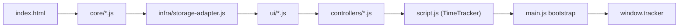

# AI Handoff Map

This document is the fastest way for a new AI session to build an accurate mental model of the current codebase.

## Read Order

Use this order instead of reading `script.js` top to bottom:

1. `README.md`
2. `index.html` for module load order
3. `main.js` for bootstrap
4. This file
5. The folder that matches the task surface:
   - `core/` for pure calculations
   - `controllers/` for interaction/state flow
   - `ui/` for DOM/string rendering
   - `infra/` for storage/integration helpers
6. Matching tests in `__tests__/`
7. `docs/actual-lock-guardrails.md` before any actual-grid change

## Runtime Shape

## Responsibility Map

| Area | Role | Read This First |
| --- | --- | --- |
| Root SPA shell | DOM shell, module order, bootstrap | `index.html`, `main.js` |
| `script.js` | `TimeTracker` class, state owner, wrappers, remaining orchestration | task-specific section below, then relevant methods |
| `core/` | pure calculations and data normalization | relevant core file + matching tests |
| `controllers/` | event routing, state transitions, cross-module orchestration | relevant controller + matching regression tests |
| `ui/` | renderer helpers, markup builders, DOM model formatting | relevant renderer + matching tests |
| `infra/` | local storage adapter and external infra glue | `infra/storage-adapter.js` and server-related tests |

## Current Core Inventory

| File | Responsibility |
| --- | --- |
| `core/time-core.js` | generic time helpers |
| `core/duration-core.js` | duration parsing and formatting |
| `core/input-format-core.js` | input normalization helpers |
| `core/date-core.js` | date math and date-key handling |
| `core/text-core.js` | text escaping and normalization |
| `core/activity-core.js` | activity text/list normalization helpers |
| `core/timesheet-state-core.js` | snapshot serialization / restoration helpers |
| `core/actual-grid-core.js` | actual-grid masks, locked rows, split segments, extra allocation, pure actual-grid builders |
| `core/grid-metrics-core.js` | grid metrics helpers |

## Current Controller Inventory

| File | Responsibility |
| --- | --- |
| `controllers/actual-input-controller.js` | actual input event normalization, parsing, timer sync, actual limit enforcement |
| `controllers/actual-modal-controller.js` | actual modal row state, rendering delegation, row add/remove/reorder, assigned/grid edits, save-finalization |
| `controllers/controller-state-access.js` | shared state accessor helpers used by multiple controllers |
| `controllers/field-interaction-controller.js` | planned-field click/drag/selection routing and merged click capture |
| `controllers/inline-plan-dropdown-controller.js` | inline planned dropdown open/close/search/select |
| `controllers/lifecycle-controller.js` | clear/reset, undo-adjacent lifecycle glue, date transitions |
| `controllers/persistence-controller.js` | local snapshot save/load, watchers, autosave orchestration |
| `controllers/planned-catalog-routine-controller.js` | planned catalog application and routine/date helpers |
| `controllers/planned-editor-controller.js` | planned title/activity/priority menus and inline plan synchronization |
| `controllers/schedule-preview-controller.js` | schedule preview data, hover button, actual hover glue |
| `controllers/selection-overlay-controller.js` | merge/undo overlay buttons and selection-adjacent floating UI |
| `controllers/supabase-sync-controller.js` | auth/session/realtime/save/fetch orchestration |
| `controllers/time-entry-render-controller.js` | time-entry row render orchestration |
| `controllers/timer-controller.js` | timer eligibility, status normalization, UI state, running-timer updates |

## Current UI Inventory

| File | Responsibility |
| --- | --- |
| `ui/time-entry-renderer.js` | time-entry row markup helpers |
| `ui/actual-activity-list-renderer.js` | actual modal activity row rendering |
| `ui/time-control-renderer.js` | spinner and actual-time control rendering |

## What Still Lives In `script.js`

`script.js` is still the app hub. Expect these categories there:

- `TimeTracker` construction and DOM lookup
- in-memory state ownership
- wrapper methods that delegate to globals loaded from `core/`, `controllers/`, and `ui/`
- app-wide orchestration where multiple subsystems meet
- remaining high-coupling logic that has not been safely extracted yet

Do not assume a large `script.js` method means the correct fix belongs there. Many surfaces already have extracted helpers behind wrappers.

## Task-Oriented Read Paths

### Planned editing / selection

Read in this order:

1. `controllers/field-interaction-controller.js`
2. `controllers/selection-overlay-controller.js`
3. `controllers/inline-plan-dropdown-controller.js`
4. `controllers/planned-editor-controller.js`
5. `controllers/time-entry-render-controller.js`
6. Relevant tests:
   - `__tests__/planned-inline-dropdown-toggle-regression.test.js`
   - `__tests__/planned-merge-selection-regression.test.js`
   - `__tests__/selection-overlay-controller.test.js`
   - `__tests__/inline-plan-dropdown-controller.test.js`

### Actual modal and actual input

Read in this order:

1. `controllers/actual-modal-controller.js`
2. `controllers/actual-input-controller.js`
3. `ui/actual-activity-list-renderer.js`
4. `ui/time-control-renderer.js`
5. Relevant tests:
   - `__tests__/actual-modal-assignment-regression.test.js`
   - `__tests__/actual-input-controller.test.js`
   - `__tests__/time-control-renderer.test.js`

### Actual-grid / locking / extra allocation

Read in this order:

1. `docs/actual-lock-guardrails.md`
2. `core/actual-grid-core.js`
3. `controllers/actual-modal-controller.js`
4. `controllers/time-entry-render-controller.js`
5. Relevant tests:
   - `__tests__/actual-grid-locked-toggle-regression.test.js`
   - `__tests__/actual-grid-failed-click-regression.test.js`
   - `__tests__/actual-modal-assignment-regression.test.js`
   - `__tests__/actual-grid-core.test.js`

Treat these as one feature surface:

- locked row classification
- effective lock mask
- assigned-duration edits
- locked row regeneration
- grid graphics
- click blocking
- failed-click behavior
- extra-slot allocation

### Timer behavior

Read in this order:

1. `controllers/timer-controller.js`
2. `controllers/actual-input-controller.js`
3. `ui/time-control-renderer.js`
4. Relevant tests:
   - `__tests__/timer-controller.test.js`
   - `__tests__/actual-input-controller.test.js`

### Persistence / sync

Read in this order:

1. `core/timesheet-state-core.js`
2. `controllers/persistence-controller.js`
3. `infra/storage-adapter.js`
4. `controllers/supabase-sync-controller.js`
5. Relevant tests:
   - `__tests__/refactor-baseline-stage1.test.js`
   - persistence-related tests
   - bootstrap regression tests

## Test Mapping

| Surface | Minimum command | Extra requirement |
| --- | --- | --- |
| Actual-grid / locking / extra allocation | `npm run test:actual-lock` | Then run `npm test`, plus browser smoke |
| Planned selection / merge / dropdown | targeted `node --test` for planned regressions | Browser smoke required |
| Timer and actual input | targeted `node --test` for timer/input tests | Browser smoke required if UI behavior changes |
| Persistence / save/load | targeted persistence tests | Browser smoke required for save/load |
| Pure core helper changes | matching core tests | Add browser smoke if rendered behavior can change |

## Known Repository Facts

- `server.js` still imports Telegram bridge modules that are not present in the current repository state. This is a known mismatch. Expect bridge-related tests or `npm start` to fail until that path is reconciled.
- Some legacy Korean literals and comments are mojibake. For behavior tracing, rely on ids, classes, data attributes, and tests instead of raw visible strings.
- Historical stage docs in `docs/refactor-stage*.md` explain why earlier extractions happened, but they are not the current source of truth.

## When To Open Historical Docs

Use `docs/refactor-stage*.md` only when you need one of these:

- why a helper was extracted in a specific stage
- what a previous boundary looked like
- whether a regression test was introduced for a past bug

Otherwise, stay on the current docs and current code.
